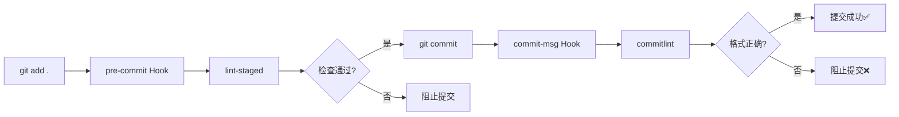

# ⚡ 工程化配置速查表

## 📁 配置文件一览表

| 文件 | 作用 | 触发时机 | 主要功能 |
|------|------|----------|----------|
| **commitlint.config.mjs** | Git 提交信息规范 | `git commit` | 检查提交格式（feat/fix/docs...） |
| **eslint.config.mjs** | JS/TS 代码检查 | 保存文件 / `pnpm lint` | 代码规范、错误检测、自动修复 |
| **stylelint.config.mjs** | CSS 样式检查 | 保存文件 / `pnpm lint:stylelint` | 样式规范、属性排序 |
| **lint-staged.config.mjs** | 暂存文件检查 | `git commit` 前 | 只检查要提交的文件 |
| **.editorconfig** | 编辑器配置 | 打开文件 | 统一缩进、换行、编码 |
| **vite.config.ts** | 构建配置 | `pnpm dev` / `pnpm build` | 插件、别名、代理、优化 |
| **uno.config.ts** | 原子化 CSS | 实时 | 按需生成 CSS 类 |
| **.npmrc** | 包管理配置 | `pnpm install` | 镜像源、依赖提升 |
| **tsconfig.json** | TypeScript 配置 | `pnpm type-check` | 类型检查、编译选项 |
| **.gitignore** | Git 忽略规则 | `git add` | 忽略文件/文件夹 |

---

## 🔄 工作流速查

### Git 提交流程



### 代码检查层级

```
┌─────────────────────────────────┐
│  1. EditorConfig                │  ← 编辑器级别
│     统一缩进、换行、编码         │
├─────────────────────────────────┤
│  2. ESLint + Stylelint          │  ← 保存时
│     自动修复格式和简单错误       │
├─────────────────────────────────┤
│  3. Lint-staged                 │  ← 提交时
│     检查暂存区文件               │
├─────────────────────────────────┤
│  4. Commitlint                  │  ← 提交信息
│     验证提交格式                 │
├─────────────────────────────────┤
│  5. TypeScript                  │  ← 构建时
│     类型检查                     │
└─────────────────────────────────┘
```

---

## 📝 常用命令速查

### 开发命令

```bash
pnpm dev              # 🚀 启动开发服务器 (http://localhost:5173)
pnpm build            # 🏗️  生产构建 (dist/)
pnpm preview          # 👁️  预览构建结果
```

### 代码检查

```bash
pnpm lint             # 🔍 检查代码 (只报错，不修复)
pnpm lint:fix         # 🛠️  自动修复代码
pnpm lint:stylelint   # 💄 检查并修复样式
pnpm type-check       # 📋 TypeScript 类型检查
```

### Git 相关

```bash
git add .                    # 添加到暂存区
git commit -m "feat: xxx"    # 提交 (自动触发检查)
pnpm lint:lint-staged        # 手动运行 lint-staged
```

### 依赖管理

```bash
pnpm install          # 📦 安装所有依赖
pnpm add axios        # ➕ 添加依赖
pnpm remove axios     # ➖ 移除依赖
pnpm update           # 🔄 更新依赖
```

---

## 📌 提交信息规范

### 提交类型

| 类型 | 说明 | 示例 |
|------|------|------|
| **feat** | ✨ 新功能 | `feat: 添加用户登录` |
| **fix** | 🐛 修复 Bug | `fix: 修复登录失败问题` |
| **docs** | 📝 文档 | `docs: 更新 API 文档` |
| **style** | 💄 格式 | `style: 格式化代码` |
| **refactor** | ♻️  重构 | `refactor: 重构用户模块` |
| **perf** | ⚡ 性能 | `perf: 优化列表渲染` |
| **test** | ✅ 测试 | `test: 添加单元测试` |
| **build** | 📦 构建 | `build: 升级 Vite 到 5.0` |
| **ci** | 👷 CI/CD | `ci: 添加 GitHub Actions` |
| **chore** | 🔧 其他 | `chore: 更新依赖` |
| **revert** | ⏪ 回滚 | `revert: 撤销上次提交` |

### 提交格式

```
<type>(<scope>): <subject>

<body>

<footer>
```

**示例**：
```
feat(user): 添加用户登录功能

- 实现登录表单
- 添加表单验证
- 集成后端 API

Closes #123
```

---

## 🎨 ESLint 规则速查

### 常用规则

```javascript
// ✅ 允许使用 console
'no-console': 'off'

// ✅ 不强制组件自闭合
'vue/html-self-closing': 'off'

// ✅ 组件命名使用 kebab-case
'vue/component-name-in-template-casing': ['error', 'kebab-case']
```

### 行内禁用

```javascript
// 禁用整个文件
/* eslint-disable */

// 禁用下一行
// eslint-disable-next-line no-console
console.log('debug')

// 禁用特定规则
/* eslint-disable no-console, no-unused-vars */
```

---

## 💅 Stylelint 规则速查

### CSS 属性顺序

Stylelint 会自动按照以下顺序排列 CSS 属性：

```css
.element {
  /* 1. 定位 */
  position: absolute;
  top: 0;
  left: 0;
  z-index: 10;
  
  /* 2. 盒模型 */
  display: flex;
  width: 100px;
  height: 100px;
  padding: 10px;
  margin: 10px;
  border: 1px solid #000;
  
  /* 3. 排版 */
  font-size: 14px;
  line-height: 1.5;
  text-align: center;
  
  /* 4. 视觉 */
  background: #fff;
  color: #000;
  opacity: 1;
  
  /* 5. 其他 */
  cursor: pointer;
  transition: all 0.3s;
}
```

### 行内禁用

```css
/* stylelint-disable */
.element { ... }
/* stylelint-enable */

/* 禁用下一行 */
/* stylelint-disable-next-line */
.element { ... }
```

---

## 🔧 Vite 配置速查

### 常用配置

```typescript
// 路径别名
alias: {
  '@': '/src',
  '@components': '/src/components',
}

// 开发代理
proxy: {
  '/api': {
    target: 'http://localhost:3000',
    changeOrigin: true,
    rewrite: (path) => path.replace(/^\/api/, '')
  }
}

// 环境变量
.env.development      # 开发环境
.env.production       # 生产环境
import.meta.env.VITE_APP_TITLE
```

---

## 🎯 UnoCSS 速查

### 常用类名

```html
<!-- 布局 -->
<div class="flex justify-center items-center">居中</div>
<div class="grid grid-cols-3 gap-4">网格</div>

<!-- 尺寸 -->
<div class="w-full h-screen">全宽全高</div>
<div class="w-100 h-100">宽高 100px</div>

<!-- 间距 -->
<div class="p-4 m-2">padding margin</div>
<div class="px-4 py-2">水平垂直间距</div>

<!-- 颜色 -->
<div class="bg-blue-500 text-white">背景文字</div>

<!-- 快捷方式 (自定义) -->
<div class="center">flex 居中</div>
<div class="size100">w100 h100</div>
```

### 动态类

```vue
<div :class="`w-${width}`">动态宽度</div>
<div class="hover:bg-blue-500">悬停效果</div>
<div class="md:w-1/2">响应式</div>
```

---

## 📦 依赖版本速查

### 核心依赖

```json
{
  "vue": "^3.4.29",
  "vite": "^5.3.1",
  "typescript": "~5.4.0",
  "pinia": "^2.1.7",
  "vue-router": "^4.3.3"
}
```

### 工程化工具

```json
{
  "@antfu/eslint-config": "^3.7.1",
  "eslint": "^9.10.0",
  "stylelint": "^16.9.0",
  "commitlint": "^19.5.0",
  "husky": "^8.0.0",
  "lint-staged": "^15.2.10"
}
```

---

## 🚨 常见问题

### 1. 提交被阻止

```bash
# 问题：提交时被 commitlint 阻止
✖  subject may not be empty
✖  type may not be empty

# 解决：使用正确的提交格式
git commit -m "feat: 添加新功能"
```

### 2. ESLint 报错

```bash
# 问题：代码格式不符合规范
✖  Expected linebreaks to be 'LF' but found 'CRLF'

# 解决：自动修复
pnpm lint:fix
```

### 3. 依赖安装失败

```bash
# 问题：使用 npm/yarn 安装
ERR! Use "pnpm install" instead

# 解决：使用 pnpm
pnpm install
```

### 4. 类型检查失败

```bash
# 问题：TypeScript 类型错误
error TS2322: Type 'string' is not assignable to type 'number'

# 解决：修复类型或添加类型断言
const count: number = Number(value)
// 或
const count = value as number
```

---

## 🎓 学习资源

### 官方文档

- [Vite](https://vitejs.dev/)
- [Vue 3](https://vuejs.org/)
- [TypeScript](https://www.typescriptlang.org/)
- [ESLint](https://eslint.org/)
- [Stylelint](https://stylelint.io/)
- [Commitlint](https://commitlint.js.org/)
- [UnoCSS](https://unocss.dev/)

### 规范文档

- [Conventional Commits](https://www.conventionalcommits.org/)
- [Angular 提交规范](https://github.com/angular/angular/blob/main/CONTRIBUTING.md)
- [Airbnb JavaScript Style Guide](https://github.com/airbnb/javascript)

---

## 💡 最佳实践

### ✅ 推荐

```bash
# 小步提交
git commit -m "feat: 添加登录按钮"
git commit -m "feat: 添加登录逻辑"

# 使用 pnpm
pnpm add axios

# 提交前检查
pnpm lint
pnpm type-check

# 使用路径别名
import { xxx } from '@/utils/xxx'
```

### ❌ 不推荐

```bash
# 大批量提交
git commit -m "完成了很多功能"

# 混用包管理器
npm install
yarn add xxx

# 跳过检查
git commit --no-verify

# 使用相对路径
import { xxx } from '../../utils/xxx'
```

---

**快速上手，享受开发！** 🚀

