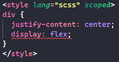
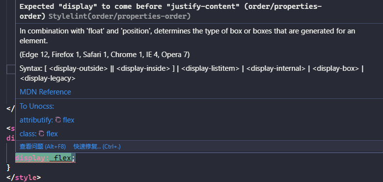
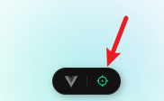
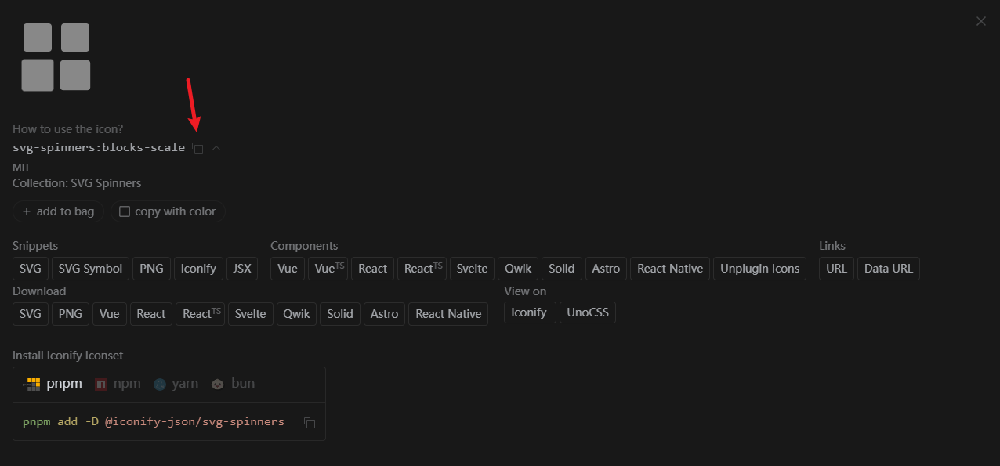
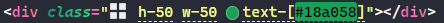
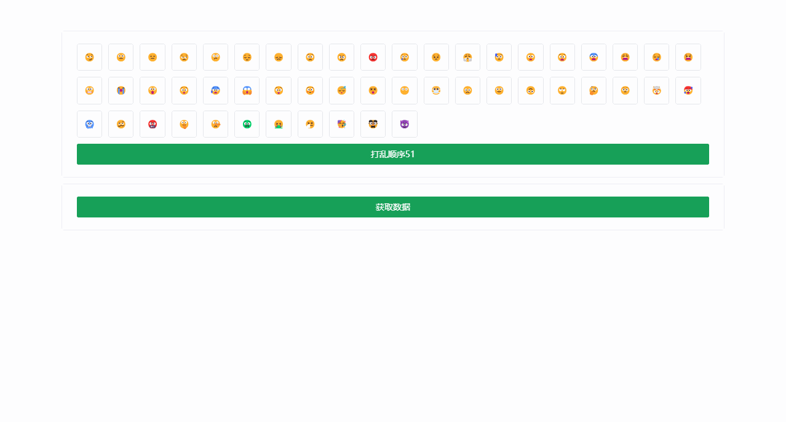
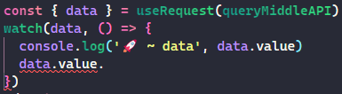
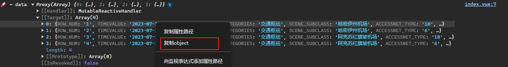
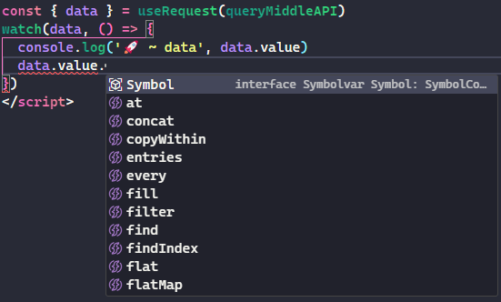
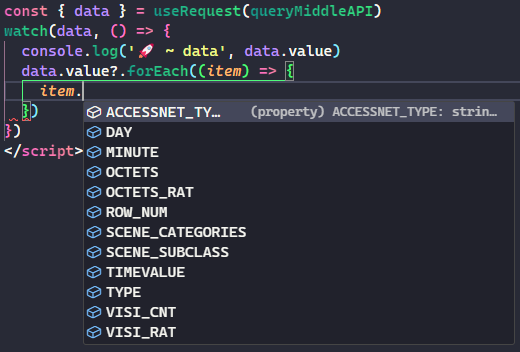

想要了解更多项目中倚赖包的详细用法，可通过[npm官网](https://www.npmjs.com/)并输入包名查看其官方文档

## IDE

推荐使用的 IDE 是 [VS Code](https://code.visualstudio.com/)，配合 [Vue - Official 扩展](https://marketplace.visualstudio.com/items?itemName=Vue.volar) (之前是 Volar)。该插件提供了语法高亮、TypeScript 支持，以及模板内表达式与组件 props 的智能提示。

TIP：Vue - Official 取代了之前为 Vue 2 提供的官方 VS Code 扩展 [Vetur](https://marketplace.visualstudio.com/items?itemName=octref.vetur)。如果你之前已经安装了 Vetur，请确保在 Vue 3 的项目中禁用它。

[Vue官网都这么说了](https://cn.vuejs.org/guide/scaling-up/tooling.html#ide-support)，你还不用吗😏

## 注意

- 为了更好的开发体验，请务必安装项目推荐的插件，打开项目会自动提示安装。详情见 .vscode/extensions.json
- 为保存项目目录清爽，部分不经常打开的文件可以隐藏。详情见 .vscode/settings.json的files.exclude
- 大部分项目都不需要vue-router，推荐根据情况自己删除该部分内容
- node > 20

## 推荐使用pnpm

为什么？[pnpm 是凭什么对 npm 和 yarn 降维打击的](https://juejin.cn/post/7127295203177676837?searchId=20241015112335FE451690C0D8951652E6)

```js
pnpm install
git add .
git commit -m 'init'
pnpm dev
```

## git相关

创建一个git仓库是必要的。通过Husky+lint-staged+commitlint的使用可以提高项目团队的工作效率，确保代码库中的代码符合特定的质量标准。

- ### [husky](https://link.juejin.cn?target=https%3A%2F%2Ftypicode.github.io%2Fhusky%2Fzh%2F)

> husky 是一个用于简化Git钩子（hooks）的设置的工具，允许开发者轻松地在各种Git事件触发时运行脚本。例如，在提交之前（pre-commit）、推送之前（pre-push）、或者在提交信息被写入后（commit-msg）等。

- ### **[lint-staged](https://link.juejin.cn?target=https%3A%2F%2Fgithub.com%2Flint-staged%2Flint-staged)**

> lint-staged 是一个在提交代码之前运行linter或其他工具的工具。这意味着当开发人员尝试提交代码到版本控制系统（如git）时，lint-staged 会只对暂存区（staged files）的文件运行配置的命令，这通常是代码风格检查器（如ESLint、Prettier）、代码格式化工具或测试套件。
>
> 使用lint-staged可以确保只有符合项目规定代码质量标准的代码被提交，减少了不必要的错误和风格问题被引入代码库的可能性。

- ### **[commitlint](https://link.juejin.cn?target=https%3A%2F%2Fcommitlint.js.org%2F)**

> 用于检测`git`提交的`message`是否符合规范，如果不符合规范则提交失败。相关说明可以在commitlint.config.mjs文件中查看。提交信息举例：feat: 添加登录功能

## eslint

模板采用eslint9以及[antfu的方案](https://github.com/antfu/eslint-config)：@antfu/eslint-config进行配置。保存时会自动格式化。另外可以通过pnpm lint:fix对全部可格式化文件进行格式化。另外，建议文件夹命名和文件命名都采用kebab-case方式（即各个单词之间通过`-`组合起来）

## stylelint

[stylelint](https://link.juejin.cn/?target=https%3A%2F%2Fstylelint.io%2F)为css的lint工具。可格式化css代码，检查css语法错误与不合理的写法，指定css书写顺序等...

例如：当我们编写以下代码会报错。



鼠标移入查看
提示我们justify-content: center;应该在display: flex;前面，这个时候我们直接ctrl+s保存，stylelint就可以自动帮我们格式化为正确的格式了。另外可以通过pnpm lint:stylelint对全部可格式化文件进行格式化。

## [unocss](https://unocss-cn.pages.dev/guide/)

网上很多人说千万别用😧，用了就回不去啦😮。那原子化CSS的优势在哪儿呢？

- 不用想类名！相信很多人在编写样式类的时候经常会纠结类名，原子化提供的类名都是能够一眼就能知道大概意思又比直接编写style更加简洁

- ”无需离开您的HTML，即可快速建立现代网站，确实，对于现在组件化开发的方式来说，单个组件文件相比以前一个html对应一个页面来说代码量要小很多，可能就几行html的组件代码，直接在html中编写样式是个更好的选择

- 利用原子化框架提供的预设原子类，极大地提高开发效率，将更多时间用在页面构造而不是重复地编写相似的代码

- IDE支持，VS Code 的unocss 智能提示扩展涵盖了所有的类。在编辑器内既可得到智能的自动完成建议、提示及类定义等功能，而且无需配置。

你可能没听过unocss，但你肯定听过tailwindcss，那[为什么](https://unocss-cn.pages.dev/guide/why)选择unocss而不是tailwindcss呢？

具体如何使用大家可以花一丢丢时间到官网查看，这里分享一下很方便的插件unot：支持将css直接通过快捷键 `Mac` ? `cmd+alt+v` : `ctrl+alt+v` 自动转换成unocss。例如我复制了width: 10px;，光标在元素的class中时按下快捷键会生成w-[10px]的unocss的class名。

另外，在网上看见有的人说这样没有了class类名，css都写在标签上面会导致后期维护困难，找不到页面中元素对应代码中的位置。刚好，vue-devtools弥补了这点



这个东西可以让你点击页面中元素后，自动在vscode中找到你当前点击的元素对应代码位置，并在vscode中打开该文件，并把光标放在当前元素的位置。实在是太贴心了。

## 图标方案

图标方案大家可以看看[这篇文章](https://antfu.me/posts/icons-in-pure-css-zh)，这个来自 UnoCSS 的图标解决方案，或者能为你提供灵感，用于你自己的项目。当然，这个模板就是使用的这个方案。

如何使用：

1. 在[图标网站](https://icones.js.org/)上需找自己想要的图标（已有超过200,000的图标，太可怕了🥵）

2. 

3. 注意有一个前缀 i- 需要拼接到复制的类名前，然后就可以通过设置该div的宽高和字体颜色控制图标样式了

   ```js
   <div class="i-svg-spinners:blocks-scale h-50 w-50 text-[#18a058]"></div>
   ```

简直是太太太简便了🤯，如果你安装了模板推荐的插件，还可以直接在vscode中得到这样的效果，这不爽死了吗😵


## 动画相关

模板使用到了两个动画相关的库：[@vueuse/motion](https://motion.vueuse.org/)，[@formkit/auto-animate](https://auto-animate.formkit.com/)，用最少的代码让页面动起来。具体可以查看模板中src/views/home/index.vue文件，只使用了*v-auto-animate*，_v-motion-slide-bottom_，*v-motion-slide-top*三个指令，没有任何其它污染业务代码的东西。



## 网络请求相关

项目模板已封装queryMysql和queryMiddle方法，同bdv的queryMysql和queryMiddle。

vite.config.ts中修改项目使用的数据库所在的服务器，即target。这里用213举例。

```js
server: {
  proxy: {
    '/brdcontrol-service': {
      target: 'http://192.168.5.213:5555',
    }
  }
}
```

**🍪请求接口需要cookie中有sid信息🍪**，sid信息可以通过访问vite.config.ts中修改项目使用的数据库所在的服务器的网址获取。

如何结合ts获得更好的代码提示：

1. 编写请求函数

   ```js
   export function queryMiddleAPI() {
     const sql = `select ROW_NUMBER() OVER() AS row_num,  * from prestat.mv_st_s_popapp_15min limit 4`;

     return queryMiddle({ sql });
   }
   ```

2. 在页面中调用该函数获取数据

   ```js
   const { data } = useRequest(queryMiddleAPI);
   watch(data, () => {
     console.log("🚀 ~ data", data.value);
   });
   ```

   这时候data是没有ts提示的，ts不知道从服务器获取的数据结构，在data.value.按下ctrl+i也获取不到提示。

   

3. 在控制台查看请求回的数据，并复制到数组中单个对象的数据

   

4. 在api-types.d.ts文件中按下*`Shift + Ctrl + Alt + V`*（需要安装JSON to TS插件），生成以下代码

   ```ts
   interface RootObject {
     ROW_NUM: string;
     TIMEVALUE: string;
     SCENE_CATEGORIES: string;
     SCENE_SUBCLASS: string;
     ACCESSNET_TYPE: string;
     TYPE: string;
     OCTETS: string;
     VISI_CNT: string;
     OCTETS_RAT: string;
     VISI_RAT: string;
     DAY: string;
     MINUTE: string;
   }
   ```

   修改RootObject为符合业务的变量名，如PopApp并添加类型PopApps

   ```ts
   interface PopApp {
     TIMEVALUE: string;
     SCENE_CATEGORIES: string;
     SCENE_SUBCLASS: string;
     ACCESSNET_TYPE: string;
     TYPE: string;
     OCTETS: string;
     VISI_CNT: string;
     OCTETS_RAT: string;
     VISI_RAT: string;
     DAY: string;
     MINUTE: string;
     ROW_NUM: number;
   }
   type PopApps = Nullable<PopApp>[];
   ```

5. 修改第一步的代码为，即给queryMiddle函数添加PopApps泛型

   ```ts
   export function queryMiddleAPI() {
     const sql = `select ROW_NUMBER() OVER() AS row_num,  * from prestat.mv_st_s_popapp_15min limit 4`;

     return queryMiddle<PopApps>({ sql });
   }
   ```

   这样就会有相应的提示了

   



## 权限相关

模板中使用了bdv的权限接口。会自动根据queryMysql和queryMiddle的sql语句判断需要具备什么权限才能执行该接口调用，如果用户没有该权限不会发送请求，并会提示用户。

```ts
const sqlMap: Record<string, keyof Permission> = {
  select: "query",
  insert: "add",
  delete: "delete",
  update: "modify",
};
```

模板封装了一个权限组件，用于控制需要权限查看的组件是否渲染，使用详情见模板中src/views/home/index.vue文件
